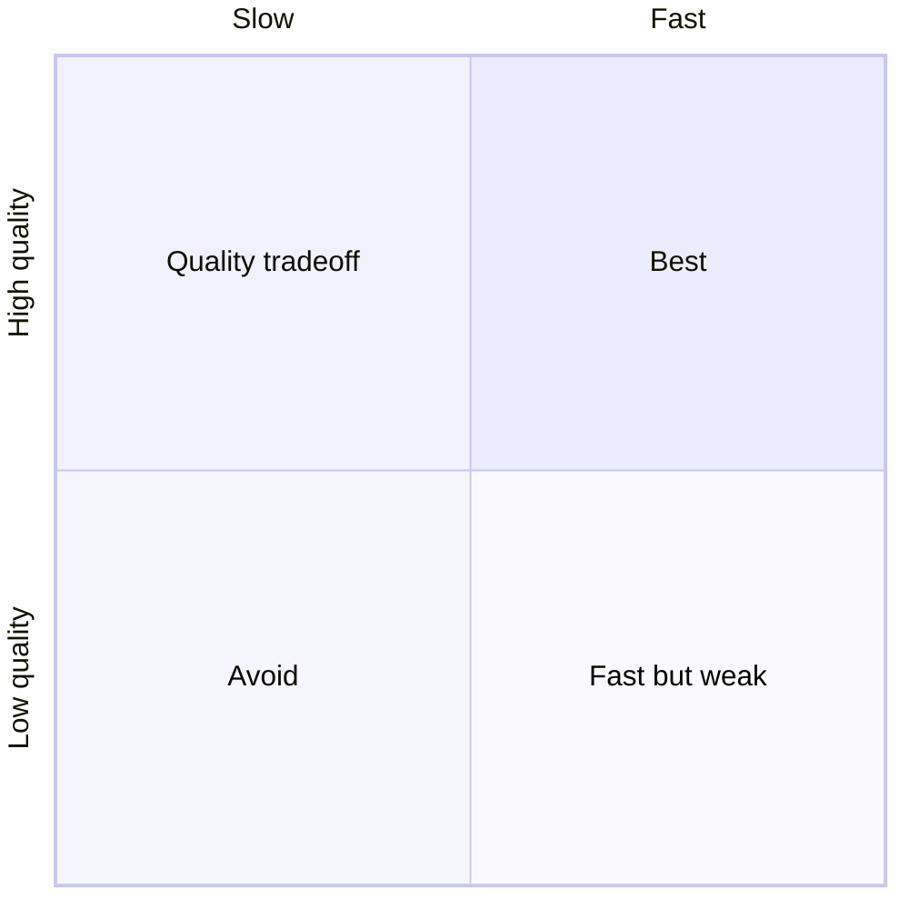

# 11 Nanobot LLMTestTool_v2 Usability Results Reporting Phase 1

## 0. 2026-05-16 구현 상태 갱신

이 문서는 최초에는 high-priority phase-1 설계안으로 작성됐고, 2026-05-16 기준으로 core usability/reporting slice 의 주요 구현이 `LLMTestTool_v2` 에 반영됐다.

현재 상태를 한 줄로 정리하면 아래와 같다.

- phase-1 핵심 목표는 대체로 구현 완료다.
- run 중심 entrypoint, suite command, launcher-first UX, detailed help, chart/report artifact, latest pointer, structured progress event 는 실제 코드와 테스트에 반영됐다.
- 다만 human progress formatter 는 설계 예시처럼 완전히 새 출력만 쓰는 상태가 아니라, 기존 step log 와 새 progress/event 출력이 함께 남아 있는 혼합 상태다.
- legacy `results/models`, `results/compare` 경로는 호환성 때문에 계속 함께 쓴다. 새 `suite` 실행은 동일 artifact 를 `results/runs/<run-id>/` 아래에도 함께 저장한다.
- 이번 세션에서는 local summary 기준의 실제 `suite --prompt-set standard --repeat 1` 실행과 `--json` event stream 까지 검증했다. `suite --prompt-set all --repeat 1 --summary-provider openai` 실실행은 이번 세션에서 다시 돌리지 않았다.

현재 기준 구현/검증 상태는 아래처럼 읽는다.

- `완료`: phase-1 목표가 구현과 테스트 기준으로 반영됨
- `부분 완료`: 설계 방향은 반영됐지만 출력 형태나 후속 정리가 일부 남음
- `미검증`: 코드나 설계는 있으나 이번 세션에서 해당 live path 를 다시 확인하지 않음

## 1. 문서 목적

이 문서는 `/Volumes/ExtData/AI_Project/LLMTestTool_v2` 의 현재 기능을 유지하면서, 결과 디렉터리 구조, 실행 로그, interactive mode, 전체 테스트 실행 UX, 최종 리포트 시각화를 개선하기 위한 high-priority phase-1 실행 설계안이다.

이번 단계의 목표는 여섯 가지다.

- `results/` 아래 artifact 가 `models`, `compare`, `reports` 로 흩어져 보이는 문제를 run 중심 구조로 단순화하기
- 장시간 benchmark 중 현재 어떤 단계가 진행 중인지 한눈에 보이도록 phase/progress 로그를 개선하기
- `./llmtesttool --help` 만 실행해도 단순 실행, suite 실행, 결과 확인, interactive mode 사용법을 알 수 있도록 자세한 help 를 추가하기
- 옵션 없이 `./llmtesttool` 을 실행했을 때 command shell 보다 `작업 선택 중심 interactive launcher` 로 사용성을 바꾸기
- interactive mode 에서 구현된 모델 비교 테스트 전체를 한 번에 실행하는 쉬운 명령과 메뉴를 추가하기
- 최종 report 에 숫자 요약만이 아니라 도표/그래프/승자 matrix 를 포함해 결론이 바로 보이게 만들기

이 문서는 이전 문서들과 달리 기능 추가보다 `운영자 사용성` 을 1순위로 둔다. answer evaluation phase 와도 연결되지만, 이 문서의 중심은 `실행하기 쉽고, 진행 상황을 믿을 수 있고, 결과를 찾기 쉬운 도구` 로 정리하는 것이다.

## 2. 왜 지금 필요한가

현재 `LLMTestTool_v2` 는 raw, assistant, stress, bundle, prompt-set sweep, OpenAI summary 까지 기능은 빠르게 늘었지만 UX 는 초기 CLI 형태에 가깝다.

현재 드러난 문제는 아래 여섯 가지다.

1. `results/models`, `results/compare`, `results/reports` 가 서로 떨어져 있어 한 번의 실행 결과를 따라가려면 여러 디렉터리를 오가야 한다.
2. prompt-set sweep 처럼 긴 실행에서는 로그가 줄줄이 이어져, 현재 전체 진행률과 남은 작업량을 바로 알기 어렵다.
3. `./llmtesttool --help` 를 봐도 단순 실행, 전체 suite, prompt-set 선택, summary provider, 결과 위치를 한 번에 이해하기 어렵다.
4. 옵션 없이 `./llmtesttool` 을 실행하면 REPL 은 뜨지만, 사용자가 뭘 눌러야 하는지 직관적으로 알기 어렵고, 자주 쓰는 작업을 한 번에 실행하는 메뉴가 부족하다.
5. 구현된 비교 테스트 전체를 실행하려면 `bundle all --prompt-set all --repeat ... --summary-provider ...` 같은 긴 명령을 알아야 한다.
6. 최종 리포트는 수치와 문장 중심이라, 모델별 승패 구조와 tail latency, prompt-set 별 경향을 도표 형태로 빠르게 읽기 어렵다.

따라서 이번 phase 는 benchmark logic 의 정확성보다 `operator experience` 를 중심으로 본다. 실행 전에는 무엇을 돌릴지 쉽게 고르고, 실행 중에는 어디까지 왔는지 보이고, 실행 후에는 하나의 run 디렉터리와 하나의 report 로 결론을 읽을 수 있어야 한다.

## 3. phase-1 범위

포함할 것:

- run 중심 `results/runs/<run-id>/` 구조 도입
- 기존 `results/models`, `results/compare`, `results/reports` 구조와의 호환/마이그레이션 정책 정리
- 실행 계획을 먼저 계산하는 `run plan` / `task manifest` 구조 추가
- 진행률 로그 formatter 추가
- 자세한 `--help` / `h` 출력 추가
- interactive launcher menu 추가
- `full`, `suite`, 또는 `run-suite` 계열 전체 비교 실행 명령 추가
- 최종 리포트에 Markdown table, text bar chart, Mermaid chart 를 기본 chart artifact 로 추가
- README, help, backlog 문서 동기화

제외할 것:

- WebUI 기반 리포트 뷰어
- 브라우저 대시보드 또는 React app 추가
- live chart streaming
- 외부 BI 도구 연동
- 과거 모든 artifact 강제 이동
- benchmark metric 자체의 의미 변경
- answer evaluation scoring 구현 자체

## 4. 핵심 설계 결정

### 4.1 결과 저장은 run 중심으로 단순화한다

현재 구조는 아래처럼 artifact 목적별로 갈라져 있다.

```text
results/
  models/<model>/<lane>/<profile>-<timestamp>/...
  compare/<left>__vs__<right>/<profile>-<timestamp>/...
  reports/report-summary-<left>_vs_<right>-<timestamp>.md
```

이 구조는 machine-readable 하기는 하지만, 사람이 한 번의 실행 결과를 따라가기 어렵다. phase-1 에서는 새 실행부터 아래 구조를 기본값으로 바꾼다.

```text
results/
  runs/
    <datetime>-<scenario>-<left>_vs_<right>/
      README.md
      run-manifest.json
      run-log.jsonl
      models/
        lfm2/
          raw-summary.json
          assistant-summary.json
          stress-standard-results.jsonl
        qwen36/
          raw-summary.json
          assistant-summary.json
          stress-standard-results.jsonl
      compare/
        comparison.json
        comparison.md
        aggregate-summary.json
        aggregate-summary.md
      reports/
        final-summary.md
        summary-metadata.json
      charts/
        winner-matrix.md
        latency-bars.md
        token-throughput-bars.md
        prompt-set-winners.md
        mermaid-summary.md
  reports/
    report-summary-lfm2_vs_qwen36-<datetime>.md
    latest-lfm2_vs_qwen36.md
```

핵심 원칙은 아래다.

- 한 번의 실행에서 나온 모든 raw/model/compare/report/chart artifact 는 하나의 `results/runs/<run-id>/` 아래에 모인다.
- `results/reports/` 는 사람이 바로 열 최종 보고서와 latest pointer 만 둔다.
- 기존 `results/models` 와 `results/compare` 는 phase-1 에서 읽기 호환만 유지하고, 새 실행 기본 저장 위치에서는 제외한다.
- migration 은 강제하지 않는다. 대신 `migrate-results` 명령을 별도 optional slice 로 둔다.

`run-id` 는 아래 형식을 권장한다.

```text
<YYYY-MM-DD_HHMMSS>-<scenario>-<left>_vs_<right>
```

예시:

```text
2026-05-16_012808-suite-all-r20-lfm2_vs_qwen36
2026-05-16_183119-bundle-standard-r20-lfm2_vs_qwen36
```

이렇게 하면 날짜만 보고 들어갔을 때보다 `무슨 실행인지` 를 바로 알 수 있다.

### 4.2 모든 실행은 run manifest 를 먼저 만든다

장시간 실행의 진행률을 안정적으로 보여주려면 실행 전에 전체 task 수를 알아야 한다. 따라서 phase-1 에서는 command 실행 직후 아래 manifest 를 먼저 계산한다.

```json
{
  "runId": "2026-05-16_012808-suite-all-r20-lfm2_vs_qwen36",
  "scenario": "suite-all",
  "models": ["lfm2", "qwen36"],
  "promptSets": ["bilingual-mixed", "logic-intensive", "programming-intensive", "standard"],
  "repeatCount": 20,
  "summaryProvider": "openai",
  "tasks": [
    { "id": "lfm2.raw", "phase": "raw", "model": "lfm2", "weight": 1 },
    { "id": "lfm2.assistant", "phase": "assistant", "model": "lfm2", "weight": 1 },
    { "id": "lfm2.stress.bilingual-mixed", "phase": "stress", "model": "lfm2", "promptSet": "bilingual-mixed", "repeat": 20, "weight": 20 }
  ]
}
```

진행률은 task count 만으로 단순 계산하지 않고, stress repeat 처럼 긴 작업은 `weight` 를 크게 둔다. 이렇게 하면 `stress 1/20` 과 `summary 생성` 이 같은 1 step 으로 보이는 문제를 줄일 수 있다.

### 4.3 로그는 phase/progress 중심으로 재정리한다

현재 로그는 아래처럼 단계 메시지가 이어진다.

```text
[1/2] lfm2 직접 호출 benchmark 시작
[1/2] lfm2 API 경유 benchmark 시작
[1/2] lfm2 부하 테스트 시작
```

phase-1 에서는 아래 형식을 권장한다.

```text
[run] 2026-05-16_012808-suite-all-r20-lfm2_vs_qwen36
[plan] models=2 promptSets=4 repeat=20 totalWork=184

[01/04 prompt-set] bilingual-mixed
  [model 1/2] lfm2
    [raw] done 00:18.2 startup=18185ms latency=215ms
    [assistant] done 00:15.1 ttft=197ms total=15159ms
    [stress] 013/20 65% avg=8120ms worst=19895ms eta=01:24
```

로그 개선 원칙은 아래다.

- 각 line 은 `phase`, `scope`, `progress`, `important metric` 중 최소 하나를 포함한다.
- 긴 stress loop 는 매 iteration 마다 full line 을 찍지 않고, interval 또는 progress 변화 기준으로 출력한다.
- `--json` 모드에서는 사람이 읽는 로그 대신 structured event JSONL 을 출력한다.
- `run-log.jsonl` 에는 모든 progress event 를 남겨, 터미널을 닫아도 사후 분석 가능하게 한다.
- error 는 `어느 model/promptSet/caseId 에서 실패했는지` 를 반드시 포함한다.

### 4.4 help 는 사용 경로를 먼저 보여주는 상세 문서형 출력으로 바꾼다

단순히 `./llmtesttool --help` 를 실행했을 때도 현재는 실제로 무엇을 실행해야 하는지 복잡하게 보일 수 있다. phase-1 에서는 help 를 command reference 보다 `작업별 사용 설명` 에 가깝게 바꾼다.

권장 help 구성은 아래다.

```text
LLMTestTool_v2

가장 많이 쓰는 실행
  ./llmtesttool
    interactive launcher 를 연다.

  ./llmtesttool suite
    lfm2 와 qwen36 전체 비교 suite 를 실행한다.
    기본값: --prompt-set all --repeat 20

  ./llmtesttool suite --prompt-set standard --repeat 1
    짧은 smoke 비교를 실행한다.

  ./llmtesttool reports latest
    최신 최종 report 위치를 보여준다.

주요 옵션
  --prompt-set <id|all>      standard, bilingual-mixed, logic-intensive, programming-intensive, all
  --repeat <n>               stress 반복 횟수. 기본값은 20
  --summary-provider <name>  openai 또는 local
  --summary-model <model>    외부 summary 모델 override
  --json                     structured event JSON 출력

결과 위치
  results/runs/<run-id>/     실행별 전체 artifact
  results/reports/           사람이 바로 여는 최종 report
```

help 개선 원칙은 아래다.

- 첫 화면은 command 목록보다 `가장 많이 쓰는 실행` 을 먼저 보여준다.
- default repeat 은 20 으로 명시한다.
- `suite`, `interactive`, `reports latest`, `prompt-set all` 의 차이를 예시 중심으로 설명한다.
- 결과가 어디에 저장되는지 help 에서 바로 알 수 있게 한다.
- `h`, `help`, `--help` 는 같은 상세 help 를 보여준다.
- subcommand 별 help 도 최소한 `suite --help`, `reports --help` 정도는 확장 대상으로 둔다.

### 4.5 interactive mode 는 command shell 이 아니라 launcher 로 바꾼다

옵션 없는 `./llmtesttool` 은 현재 REPL 을 바로 연다. phase-1 에서는 기본 첫 화면을 아래처럼 바꾼다.

```text
LLMTestTool_v2

추천 작업
1. 전체 모델 비교 suite 실행
2. prompt-set all r20 실행
3. standard r20 빠른 비교 실행
4. 기존 결과 열기
5. 모델 목록 보기
6. 고급 명령 입력 모드
q. 종료

선택> 
```

핵심은 사용자가 긴 명령을 기억하지 않아도 된다는 점이다.

interactive mode 변경 원칙:

- 첫 화면은 번호 기반 launcher 로 둔다.
- 기존 REPL 은 `advanced`, `cmd`, `shell` 선택 시 진입한다.
- 자주 쓰는 작업은 wizard 가 아니라 single action 으로 실행 가능해야 한다.
- 실행 전에 plan preview 를 보여주고 `y` 확인을 받는다.
- 장시간 작업은 예상 작업량과 대략적 비용/소요 시간 경고를 보여준다.

### 4.6 전체 비교 테스트 실행 명령을 반드시 추가한다

사용자가 요청한 핵심 요구사항이다. phase-1 에서는 아래 두 surface 를 동시에 둔다.

직접 명령:

```bash
./llmtesttool suite
./llmtesttool suite --repeat 20 --summary-provider openai
./llmtesttool suite --prompt-set all --repeat 20 --summary-provider openai
```

interactive launcher:

```text
1. 전체 모델 비교 suite 실행
```

`suite` 의 의미는 아래로 고정한다.

- 지원 모델 전체: `lfm2`, `qwen36`
- lane 전체: `raw`, `assistant`, `stress`
- prompt set 전체: `all`
- 기본 repeat: `20`
- summary provider 기본값: `openai` 가 설정돼 있으면 `openai`, 없으면 `local auto`
- 실행 순서: 한 번에 한 모델만 기동
- 결과: run 중심 디렉터리, flat final report, chart artifact 생성

향후 answer evaluation phase 가 구현되면 `suite --with-eval` 로 품질 평가까지 붙일 수 있게 하되, phase-1 usability slice 에서는 benchmark suite 까지만 기본으로 둔다.

### 4.7 최종 리포트에는 도표형 결론을 추가한다

phase-1 에서는 별도 WebUI 없이 Markdown 에서 바로 보이는 chart 를 우선한다. 기본 포함 대상은 `Markdown table`, `text bar chart`, `Mermaid chart` 세 가지다.

권장 chart artifact:

- `winner-matrix.md`: prompt set x metric winner 표
- `latency-bars.md`: 모델별 startup, TTFT, avg latency, worst latency text bar chart
- `token-throughput-bars.md`: completion token/sec 비교 bar chart
- `prompt-set-winners.md`: prompt set 별 quick/assistant/worst winner summary
- `mermaid-summary.md`: prompt set 별 승패 흐름과 속도/품질 tradeoff 를 Mermaid 로 표현한 chart

최종 `final-summary.md` 또는 flat `report-summary-...md` 에는 아래 섹션을 추가한다.

```markdown
## 한눈에 보는 결론

| prompt set | quick | assistant | worst latency | 종합 |
| --- | --- | --- | --- | --- |
| bilingual-mixed | lfm2 | lfm2 | lfm2 | lfm2 |
| logic-intensive | lfm2 | lfm2 | qwen36 | lfm2 + qwen36 tail |

## Latency Bar

lfm2   startup █████████ 18.2s  ttft █ 197ms  worst █████████████ 19.3s
qwen36 startup █████████████ 24.8s ttft ██ 320ms  worst ███████████ 18.1s
```

Mermaid chart 도 기본 artifact 로 포함한다. Markdown renderer 가 Mermaid 를 지원하지 않는 환경에서도 원문 block 은 보존되므로, 최종 report 에 아래와 같은 Mermaid section 을 함께 넣는다.



단, phase-1 의 판단 근거는 Mermaid 렌더링에만 의존하지 않는다. 같은 결론을 Markdown table 과 text bar chart 에도 반드시 중복 표현하고, Mermaid 는 시각적 이해를 돕는 추가 기본 chart 로 포함한다.

### 4.8 리포트는 실행 결과 탐색의 entrypoint 가 되어야 한다

`results/runs/<run-id>/README.md` 는 해당 run 의 navigation page 로 둔다.

포함 항목:

- 실행 명령
- run manifest 요약
- 최종 보고서 링크
- chart 링크
- raw artifact 링크
- compare artifact 링크
- error/warning 요약

`results/reports/latest-lfm2_vs_qwen36.md` 는 최신 보고서를 복사하거나 짧은 redirect-style 문서로 둔다. symlink 는 환경에 따라 깨질 수 있으므로 phase-1 에서는 Markdown 파일 복사 또는 상대 링크 문서를 권장한다.

## 5. 현재 코드 anchor

현재 기준 직접 영향을 받는 위치는 아래다.

- `/Volumes/ExtData/AI_Project/LLMTestTool_v2/llmtesttool.mjs`
- `/Volumes/ExtData/AI_Project/LLMTestTool_v2/lib/cli-ui.mjs`
- `/Volumes/ExtData/AI_Project/LLMTestTool_v2/lib/fs-utils.mjs`
- `/Volumes/ExtData/AI_Project/LLMTestTool_v2/lib/reporting.mjs`
- `/Volumes/ExtData/AI_Project/LLMTestTool_v2/lib/prompt-set-sweep-summary.mjs`
- `/Volumes/ExtData/AI_Project/LLMTestTool_v2/lib/comparison-summary.mjs`
- `/Volumes/ExtData/AI_Project/LLMTestTool_v2/lib/bundle.mjs`
- `/Volumes/ExtData/AI_Project/LLMTestTool_v2/lib/stress-lane.mjs`
- `/Volumes/ExtData/AI_Project/LLMTestTool_v2/README.md`
- `/Volumes/ExtData/AI_Project/LLMTestTool_v2/tests/*.test.mjs`

새 작업공간 기준 추가 대상은 아래로 본다.

- `/Volumes/ExtData/AI_Project/LLMTestTool_v2/lib/run-manifest.mjs`
- `/Volumes/ExtData/AI_Project/LLMTestTool_v2/lib/progress-reporter.mjs`
- `/Volumes/ExtData/AI_Project/LLMTestTool_v2/lib/result-layout.mjs`
- `/Volumes/ExtData/AI_Project/LLMTestTool_v2/lib/report-charts.mjs`
- `/Volumes/ExtData/AI_Project/LLMTestTool_v2/lib/interactive-launcher.mjs`
- `/Volumes/ExtData/AI_Project/LLMTestTool_v2/lib/help-content.mjs`
- `/Volumes/ExtData/AI_Project/LLMTestTool_v2/tests/run-manifest.test.mjs`
- `/Volumes/ExtData/AI_Project/LLMTestTool_v2/tests/progress-reporter.test.mjs`
- `/Volumes/ExtData/AI_Project/LLMTestTool_v2/tests/result-layout.test.mjs`
- `/Volumes/ExtData/AI_Project/LLMTestTool_v2/tests/report-charts.test.mjs`
- `/Volumes/ExtData/AI_Project/LLMTestTool_v2/tests/interactive-launcher.test.mjs`
- `/Volumes/ExtData/AI_Project/LLMTestTool_v2/tests/help-content.test.mjs`

## 6. 작업 분해

### Step 1. run 중심 result layout 설계/도입

상태: `완료`

- `results/runs/<run-id>/` path helper 추가
- 기존 compare/model/report path 는 read compatibility 로 유지
- 새 실행 artifact 는 run directory 아래에 모이게 writer 변경
- flat report 는 `results/reports/` 아래 계속 유지

### Step 2. run manifest 추가

상태: `완료`

- command 입력을 실행 전 `run-manifest.json` 으로 정규화
- model, lane, promptSet, repeat, summary provider, task weight 를 manifest 에 기록
- manifest 기반 progress total 계산 추가

### Step 3. progress reporter 추가

상태: `부분 완료`

- terminal human mode formatter 추가
- JSON event mode 추가
- stress loop progress callback 추가
- run-log.jsonl writer 추가

메모:

- `run-log.jsonl` 과 `--json` stdout event stream 은 구현됐다.
- human mode 에서 stress progress line 도 출력되지만, 설계 예시처럼 전체 로그가 완전히 새 formatter 한 종류로 통일된 상태는 아니다.

### Step 4. detailed help 추가

상태: `완료`

- `--help`, `h`, `help` 에서 같은 상세 help 출력
- 자주 쓰는 실행 예시, 기본값, 결과 위치, prompt set 목록을 포함
- `suite --help`, `reports --help` 같은 subcommand help 확장 여지 추가

### Step 5. interactive launcher 추가

상태: `완료`

- 옵션 없는 실행 첫 화면을 launcher 로 변경
- 기존 REPL 은 advanced command mode 로 이동
- launcher 에 전체 suite 실행, 기존 결과 열기, 모델 목록, prompt set 보기 추가

### Step 6. suite command 추가

상태: `완료`

- `suite` command 를 추가해 구현된 모델 비교 테스트 전체를 한 번에 실행
- interactive launcher 의 1번 메뉴가 `suite --prompt-set all --repeat 20` 과 동등하게 동작
- 실행 전 plan preview 와 confirmation 추가

### Step 7. chart/report artifact 추가

상태: `완료`

- winner matrix renderer 추가
- latency text bar chart renderer 추가
- token throughput text bar chart renderer 추가
- Mermaid summary chart renderer 추가
- final report 에 chart section 을 자동 포함

### Step 8. docs/test 동기화

상태: `완료`

- README command examples 갱신
- results layout migration note 추가
- tests 에 layout/progress/launcher/chart 단위 검증 추가

## 7. 실제 코드 작업 backlog

### 7.1 result layout slice

- `result-layout.mjs` 추가
- `resolveRunBundlePaths(rootDir, manifest)` 구현
- `results/runs/<run-id>/README.md` writer 추가
- 기존 `resolveCompareRunPaths`, `resolveModelRunPaths` 호출부를 새 layout 로 우회하는 adapter 설계

### 7.2 manifest slice

- `run-manifest.mjs` 추가
- `buildSuiteManifest({ models, promptSets, repeatCount, summaryProvider })` 구현
- task weight 계산 로직 추가
- manifest snapshot test 추가

### 7.3 progress slice

- `progress-reporter.mjs` 추가
- `createProgressReporter({ manifest, ui, logPath })` 구현
- `reporter.startTask`, `reporter.update`, `reporter.endTask`, `reporter.failTask` 인터페이스 정의
- stress lane 에 optional `onProgress` callback 추가

### 7.4 interactive launcher slice

- `interactive-launcher.mjs` 추가
- `formatLauncherMenu()` 와 `resolveLauncherChoice()` 구현
- `startInteractiveShell()` 진입점을 launcher-first 로 변경
- advanced command mode 로 기존 REPL 유지

### 7.5 detailed help slice

- `help-content.mjs` 또는 기존 `usage()` 구조 개선
- `renderDetailedHelp()` 구현
- `renderSuiteHelp()` 와 `renderReportsHelp()` 확장 여지 확보
- default repeat 20, 주요 prompt set, 결과 위치, 대표 명령 예시 포함
- `./llmtesttool --help`, `./llmtesttool h`, interactive `help` 출력 일관화

### 7.6 suite command slice

- `commandSuite(options, ui)` 추가
- `suite` command parsing 추가
- prompt-set all, repeat 20, summary-provider auto/openai 기본값 확정
- 실행 전 manifest preview 출력

### 7.7 chart slice

- `report-charts.mjs` 추가
- `renderWinnerMatrix(summary)` 구현
- `renderLatencyBars(comparison)` 구현
- `renderThroughputBars(comparison)` 구현
- `renderMermaidSummary(summary)` 구현
- final summary renderer 에 chart section 주입

### 7.8 docs slice

- README 의 결과 경로 섹션을 run 중심 구조로 갱신
- README 의 help / suite / interactive 예시를 default repeat 20 기준으로 갱신
- interactive mode 문서를 launcher-first 로 갱신
- suite command 예시 추가
- 기존 결과 구조는 legacy 로 설명

## 8. 검증 계획

2026-05-16 실제 확인 메모:

- `npm test`: 완료
- `./llmtesttool --help`: 완료
- `./llmtesttool h`: help alias 는 기존 테스트와 command alias 기준으로 유지되지만, 이번 세션에서 별도 수동 재실행은 생략
- `./llmtesttool suite --dry-run`: 완료
- `./llmtesttool suite --prompt-set standard --repeat 1 --summary-provider local`: 완료
- `./llmtesttool suite --prompt-set standard --repeat 1 --summary-provider local --json`: 완료
- `./llmtesttool suite --prompt-set all --repeat 1 --summary-provider openai`: 이번 세션 미검증
- 생성된 `results/runs/<run-id>/README.md`, `run-manifest.json`, `run-log.jsonl`, `charts/*.md`: standard r1 run 기준 확인 완료
- `./llmtesttool reports latest`, `./llmtesttool reports latest --json`: 완료

권장 검증 순서는 아래다.

1. `cd /Volumes/ExtData/AI_Project/LLMTestTool_v2 && npm test`
2. `cd /Volumes/ExtData/AI_Project/LLMTestTool_v2 && ./llmtesttool --help`
3. `cd /Volumes/ExtData/AI_Project/LLMTestTool_v2 && ./llmtesttool h`
4. `cd /Volumes/ExtData/AI_Project/LLMTestTool_v2 && ./llmtesttool suite --dry-run`
5. `cd /Volumes/ExtData/AI_Project/LLMTestTool_v2 && ./llmtesttool suite --prompt-set standard --repeat 1 --summary-provider local`
6. `cd /Volumes/ExtData/AI_Project/LLMTestTool_v2 && ./llmtesttool suite --prompt-set all --repeat 1 --summary-provider openai`
7. 생성된 `results/runs/<run-id>/README.md` 확인
8. 생성된 `results/runs/<run-id>/run-manifest.json` 확인
9. 생성된 `results/runs/<run-id>/run-log.jsonl` 확인
10. 생성된 `results/runs/<run-id>/charts/*.md` 확인. `winner-matrix.md`, `latency-bars.md`, `token-throughput-bars.md`, `prompt-set-winners.md`, `mermaid-summary.md` 를 포함해야 한다.
11. 생성된 `results/reports/report-summary-*.md` 에 Markdown table, text bar chart, Mermaid section 이 들어갔는지 확인

focused UX 검증은 아래를 포함한다.

- 옵션 없는 `./llmtesttool` 첫 화면이 launcher 로 뜨는지 확인
- `./llmtesttool --help` 출력만 보고 기본 실행, suite, prompt set, repeat 기본값, 결과 위치를 이해할 수 있는지 확인
- launcher 1번에서 전체 suite plan preview 가 보이는지 확인
- plan preview 에 model 수, prompt set 수, repeat, 예상 work count 가 보이는지 확인
- stress 진행 중 `013/20 65%` 형태 progress 가 보이는지 확인
- JSON mode 에서는 human log 대신 event JSON 이 출력되는지 확인
- 실패 시 model/promptSet/caseId 가 error line 에 포함되는지 확인
- `results/reports/latest-lfm2_vs_qwen36.md` 가 최신 report 를 가리키는지 확인

## 9. 완료 기준

1. `완료` 새 benchmark 실행은 run 중심 `results/runs/<run-id>/` 아래에 주요 artifact 를 모은다.
2. `완료` `results/reports/` 는 사람이 바로 볼 final report 와 latest report entrypoint 를 제공한다.
3. `부분 완료` 장시간 실행 로그는 stress repeat progress 와 structured event 를 보여주지만, human log 전체가 설계 예시 수준으로 완전히 재포맷된 상태는 아니다.
4. `완료` 옵션 없는 `./llmtesttool` 은 launcher-first interactive UX 를 제공한다.
5. `완료` interactive mode 에서 전체 모델 비교 suite 를 한 번에 실행하는 메뉴가 있다.
6. `완료` `./llmtesttool --help`, `./llmtesttool h`, interactive `help` 는 기본 실행법, suite, default repeat 20, 결과 위치를 자세히 보여준다.
7. `완료` 직접 명령으로도 `./llmtesttool suite --prompt-set all --repeat 20 --summary-provider openai` 를 실행할 수 있다.
8. `완료` 최종 report 에 winner matrix, latency bars, throughput bars, Mermaid summary 같은 도표형 결론이 포함된다.
9. `완료` 기존 artifact 를 읽는 command 는 phase-1 에서 깨지지 않는다.
10. `완료` README 와 execution-backlog index 가 새 high-priority usability slice 를 설명한다.

## 10. 다음 단계 연결

- 이 문서는 `10-nanobot-llmtesttool-v2-answer-evaluation-phase1.md` 보다 우선순위가 높다.
- answer evaluation 구현은 새 `results/runs/<run-id>/evals/` 위치를 기준으로 붙이는 편이 맞다.
- phase-2 에서는 Markdown chart 를 WebUI/HTML dashboard 로 확장하거나, 기존 결과를 새 run layout 으로 마이그레이션하는 별도 slice 를 열 수 있다.
